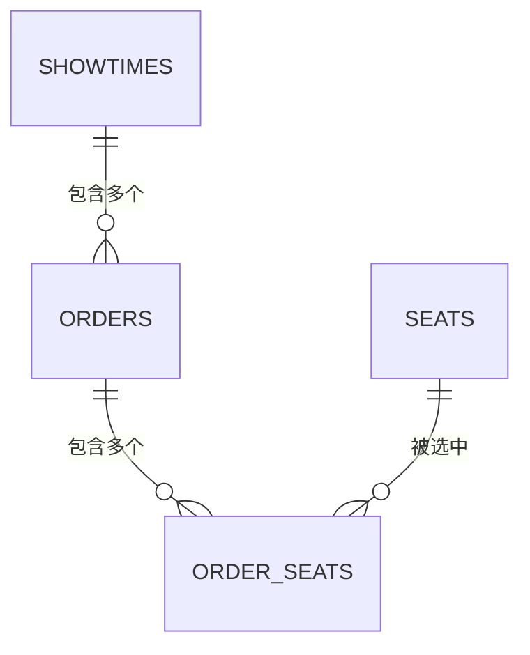

# 电影票预订系统 — E-R 图

> 基于 PowerDesigner DFD 文件中的数据存储（D1-D13）及其关系，绘制实体-关系图。

---

## 一、DFD 数据存储清单

| 编号 | 名称 | Code | 说明 |
|------|------|------|------|
| D1 | 用户数据 | user_table | 存储用户账户信息与钱包余额 |
| D2 | 电影数据 | 电影数据 | 电影基本信息 |
| D3 | 影院数据 | 影院数据 | 影院信息 |
| D4 | 影厅数据 | 影厅数据 | 影厅与座位布局 |
| D5 | 场次数据 | 场次数据 | 排片场次信息 |
| D6 | 座位数据 | 座位数据 | 座位状态 |
| D7 | 临时锁座记录 | 临时锁座记录 | 座位临时锁定状态，超时自动释放 |
| D8 | 订单数据 | 订单数据 | 订单信息 |
| D10 | 待处理订单流水 | 待处理订单流水 | 等待处理的订单数据（Redis Stream） |
| D11 | 评价数据 | 评价数据 | 用户对电影的评价信息 |
| D12 | 通知数据 | 通知数据 | 系统通知信息 |
| D13 | 电影图片数据 | 电影图片数据 | 电影海报、剧照、横幅等图片 |

---

## 二、实体关系图（文本表示）

```
                              ┌─────────────┐
                              │   CINEMAS   │
                              │   影院表     │
                              ├─────────────┤
                              │ id (PK)     │
                              │ name        │
                              │ address     │
                              │ phone       │
                              │ status      │
                              │ biz_hours   │
                              │ longitude   │
                              │ latitude    │
                              └──────┬──────┘
                                     │
                                     │ 1:N
                                     ▼
┌─────────────┐              ┌─────────────┐              ┌─────────────┐
│   USERS     │              │   HALLS     │              │   MOVIES    │
│   用户表     │              │   影厅表     │              │   电影表     │
├─────────────┤              ├─────────────┤              ├─────────────┤
│ id (PK)     │              │ id (PK)     │              │ id (PK)     │
│ username    │              │ cinema_id   │              │ title       │
│ password    │              │ name        │              │ duration    │
│ phone       │              │ seat_rows   │              │ release_date│
│ role        │              │ seat_cols   │              │ rating      │
│ wallet_bal  │              │ hall_type   │              │ description │
│ version     │              │             │              │ status      │
└──────┬──────┘              └──────┬──────┘              |             |
       │                            │                     └──────┬──────┘
       │                            │ 1:N                        │
       │                            ▼                            │
       │                     ┌─────────────┐                     │ 1:N
       │                     │   SEATS     │                     ▼
       │                     │   座位表     │              ┌─────────────┐
       │                     ├─────────────┤              │  SHOWTIMES  │
       │                     │ id (PK)     │              │  场次表      │
       │                     │ hall_id     │              ├─────────────┤
       │                     │ row_num     │              │ id (PK)     │
       │                     │ col_num     │              │ movie_id    │
       │                     │ seat_type   │              │ hall_id     │
       │                     │ status      │              │ show_date   │
       │                     └──────┬──────┘              │ show_time   │
       │                            │                     │ price       │
       │                            │                     │ status      │
       │                            │                     └──────┬──────┘
       │                            │                            │
       │ 1:N                        │ 1:N                        │ 1:N
       ▼                            ▼                            ▼
┌─────────────┐              ┌─────────────┐              ┌─────────────┐
│ TEMP_SEAT_  │              │ ORDER_SEATS │              │   ORDERS    │
│ LOCKS 临时锁座│              │ 订单座位关联  │              │   订单表     │
├─────────────┤              ├─────────────┤              ├─────────────┤
│ id (PK)     │              │ id (PK)     │              │ id (PK)     │
│ showtime_id │              │ order_id    │              │ order_no    │
│ seat_id     │              │ seat_id     │              │ user_id     │
│ user_id     │              │ price       │              │ showtime_id │
│ locked_at   │              └─────────────┘              │ total_amount│
│ expires_at  │                                           │ status      │
└─────────────┘                                           └──────┬──────┘
                                                                 │
       ┌─────────────────────────────────────────────────────────┘
       │ 1:N
       ▼
┌─────────────┐              ┌─────────────┐
│  PAYMENTS   │              │  REVIEWS    │
│  支付记录    │              │  评价表      │
├─────────────┤              ├─────────────┤
│ id (PK)     │              │ id (PK)     │
│ order_id    │              │ user_id     │
│ user_id     │              │ movie_id    │
│ amount      │              │ order_id    │
│ status      │              │ rating      │
│ created_at  │              │ content     │
└─────────────┘              │ created_at  │
                             └─────────────┘

┌─────────────┐
│NOTIFICATIONS│
│  通知表      │
├─────────────┤
│ id (PK)     │
│ user_id     │
│ title       │
│ content     │
│ type        │
│ status      │
│ created_at  │
└─────────────┘

┌─────────────┐
│MOVIE_IMAGES │
│ 电影图片表    │          MOVIES 1:N MOVIE_IMAGES
├─────────────┤          （一部电影拥有多张图片）
│ id (PK)     │
│ movie_id    │
│ image_url   │
│ image_type  │
│ sort_order  │
│ is_cover    │
│ created_at  │
└─────────────┘
```

---

## 四、关系说明

### 4.1 实体关系汇总

| 关系 | 类型 | 说明 |
|------|------|------|
| USERS → ORDERS | 1:N | 一个用户可以创建多个订单 |
| USERS → REVIEWS | 1:N | 一个用户可以发布多条评价 |
| USERS → TEMP_SEAT_LOCKS | 1:N | 一个用户可以锁定多个座位 |
| USERS → NOTIFICATIONS | 1:N | 一个用户可以接收多条通知 |
| MOVIES → SHOWTIMES | 1:N | 一部电影可以有多个排片场次 |
| MOVIES → REVIEWS | 1:N | 一部电影可以收到多条评价 |
| MOVIES → MOVIE_IMAGES | 1:N | 一部电影拥有多张图片（海报、剧照、横幅） |
| CINEMAS → HALLS | 1:N | 一个影院拥有多个影厅 |
| HALLS → SEATS | 1:N | 一个影厅包含多个座位 |
| HALLS → SHOWTIMES | 1:N | 一个影厅可以放映多个场次 |
| SHOWTIMES → ORDERS | 1:N | 一个场次可以产生多个订单 |
| SHOWTIMES → TEMP_SEAT_LOCKS | 1:N | 一个场次可以有多个临时锁座记录 |
| ORDERS → PAYMENTS | 1:N | 一个订单可以有多条支付记录（含退款） |
| ORDERS → ORDER_SEATS | 1:N | 一个订单包含多个座位 |
| SEATS → TEMP_SEAT_LOCKS | 1:N | 一个座位可以被多次临时锁定（不同时间段） |
| SEATS → ORDER_SEATS | 1:N | 一个座位可以出现在多个历史订单中 |
| ORDERS → REVIEWS | 1:N | 一个订单可关联一条评价（验证购买） |

### 4.2 中间表

| 表名 | 说明 |
|------|------|
| ORDER_SEATS | 订单-座位关联表，记录每个订单包含的具体座位及价格（支持情侣座、VIP座差异化定价） |

---

## 五、设计要点

### 5.1 座位定价机制

通过 `ORDER_SEATS` 中间表记录每个座位的实际价格，支持：
- 普通座：基础票价
- VIP座：基础票价 × 1.5
- 情侣座：基础票价 × 2（必须成对选择）

### 5.2 临时锁座（D7 → TEMP_SEAT_LOCKS）

- Redis 实现，TTL 15 分钟自动过期
- 不需要持久化到 MySQL，仅用于高并发场景下的原子锁座
- E-R 图中保留为逻辑实体，物理实现为 Redis 数据结构

### 5.3 待处理订单流水（D10）

- Redis Stream 实现，用于异步削峰
- 非持久化实体，不纳入 E-R 图的表结构设计

### 5.4 通知数据（D12）

- 记录系统通知、订单状态变更通知等
- 支持已读/未读状态管理

### 5.5 电影图片数据（D13 → MOVIE_IMAGES）

- 支持一部电影拥有多种类型图片：海报（poster）、剧照（still）、横幅（banner）
- `is_cover` 字段标记封面海报，前端列表优先展示
- `sort_order` 控制图片展示顺序
- 原 MOVIES 表的 `poster_url` 字段已移除，统一由 MOVIE_IMAGES 管理

---

## 六、DFD 数据流与 E-R 实体映射

| DFD 数据流 | 涉及 E-R 实体 | 说明 |
|------------|---------------|------|
| 注册信息 | USERS | 用户注册，初始化钱包余额 |
| 登录请求 | USERS | 用户登录验证 |
| 订票申请 | ORDERS, ORDER_SEATS, SHOWTIMES, SEATS | 创建订单，关联座位 |
| 退票申请 | ORDERS, PAYMENTS, SEATS | 退款，释放座位 |
| 评价内容 | REVIEWS, USERS, MOVIES | 用户评价电影 |
| 排片数据 | SHOWTIMES, HALLS, MOVIES | 管理员排片 |
| 电影图片 | MOVIE_IMAGES, MOVIES | 管理电影海报、剧照等图片 |
| 统计报表 | ORDERS, USERS, MOVIES | 数据统计分析 |

---

## 七、E-R 图解读

### 7.1 整体结构

本系统 E-R 图共包含 **13 个实体**，围绕「用户购票」这一核心业务流程展开，可分为四个领域：

| 领域 | 实体 | 职责 |
|------|------|------|
| 用户与权限 | USERS | 用户账户、钱包、角色管理 |
| 影片与排片 | MOVIES, MOVIE_IMAGES, CINEMAS, HALLS, SHOWTIMES | 电影信息、图片资源、影院影厅、场次排片 |
| 订单与支付 | ORDERS, ORDER_SEATS, PAYMENTS | 订单创建、座位关联、支付记录 |
| 座位与锁座 | SEATS, TEMP_SEAT_LOCKS | 座位管理、临时锁座（Redis 实现） |
| 互动与通知 | REVIEWS, NOTIFICATIONS | 用户评价、系统通知 |

### 7.2 核心实体关系链

系统的核心业务流可以概括为一条关系链：

```
CINEMAS → HALLS → SEATS
                → SHOWTIMES ← MOVIES
                            → ORDERS → ORDER_SEATS → SEATS
                                     → PAYMENTS
USERS → ORDERS / REVIEWS / TEMP_SEAT_LOCKS / NOTIFICATIONS
```

**解读**：
- 影院拥有影厅，影厅包含座位并承接场次排片
- 电影通过场次与影厅关联，一个电影可排多个场次
- 用户通过订单购买特定场次的座位，订单关联支付记录
- 用户还可评价电影、接收系统通知

### 7.4 实体属性设计原则

1. **主键统一**：所有实体使用 `long integer 表名_id` 自增主键，简单高效

2. **时间戳**：所有实体均有 `created_at`，涉及状态变更的增加 `updated_at`

3. **枚举约束**：状态类字段使用 `enum`，在数据库层面限制合法值

   - 用户角色：`user` / `admin`

   - 电影状态：`upcoming` / `showing` / `ended`

   - 影院状态：`open` / `suspended` / `preparing` / `closed`

   - 订单状态：`pending` / `paid` / `refunded` / `cancelled`

   - 座位类型：`normal` / `vip` / `couple`

   - 座位物理状态：`active` / `maintenance`

     在powerdesigner中使用不用的名字和code来表示不同表的状态，不然会相互绑定，共享同一个status。

4. **乐观锁**：USERS 表 `version` 字段支持钱包余额并发扣款安全，SQL 形如 `UPDATE users SET wallet_balance = wallet_balance - ?, version = version + 1 WHERE id = ? AND version = ? AND wallet_balance >= ?`

5. **业务编号**：订单表额外设置 `order_no`（唯一），便于用户查询和对外展示

6. **图片分类**：MOVIE_IMAGES 通过 `image_type` 区分海报/剧照/横幅，`is_cover` 标记封面

## 八、各表属性详解

### 8.1 USERS（用户表）

| 属性 | 类型 | 说明 |
|------|------|------|
| `id` | bigint PK | 用户唯一标识，自增主键 |
| `username` | varchar UK | 用户名，唯一约束，用于登录 |
| `password` | varchar | 密码，存储加密后的哈希值（如 BCrypt） |
| `phone` | varchar | 手机号，用于联系和找回密码 |
| `role` | enum | 角色：`user`（普通用户）/ `admin`（管理员），控制接口权限 |
| `wallet_balance` | decimal | 虚拟钱包余额，注册赠送 1000 元，支付和退款操作此字段 |
| `version` | int | 乐观锁版本号，默认 0，每次扣款/退款时 `WHERE version = ?` 防止并发超扣 |
| `created_at` | datetime | 注册时间 |
| `updated_at` | datetime | 最后更新时间 |

以下三个极其常见的真实业务场景，会瞬间触发多线程并发修改同一个钱包：

#### 场景 1：用户在手机上“狂点/连击”购票按钮（最常见）

- **过程**：前端没有做按钮置灰防重复点击，用户在网络卡顿或者心情激动时，连续点了 3 下“立即支付”。
- **结果**：前端同时向后端发送了 3 个内容完全一样的支付请求。Tomcat 瞬间分配了 **3 个不同的线程**（线程 A、B、C），同时拿着这个用户的 `user_id` 去查余额、扣款。

#### 场景 2：抢票脚本 / 恶意刷单

- **过程**：某些懂技术的用户写了个 Python 抢票脚本，为了抢到首映场黄金位置，脚本在 0.001 秒内并发调用了你们的下单扣款接口 10 次。
- **结果**：后端产生 **10 个线程** 抢着去修改这同一个 `wallet_balance`。

#### 场景 3：退款与购票同时发生（业务交织）

- **过程**：用户买了两场电影。18:00 的时候，他一边在手机上点击抢购周六的《金刚》，与此同时，他昨天申请的另一场电影退款刚好被后台管理员审核通过。
- **结果**：
  - **线程 A**（用户触发）：去执行**扣款** 50 元。
  - **线程 B**（系统后台退款触发）：去执行**加款** 50 元。
  - 两个线程在同一毫秒内，都在操作同一个 `id` 的用户钱包。


解决方法：

### 1. 为什么必须提前记录之前的 `version` 值？

因为如果你不提前记录，你就没有办法把“你当时看到的版本”传给 SQL 语句中的 `#{currentVersion}`。

整个业务流在 Java（后端）和 MySQL（数据库）之间是这样流转的：

- **步骤 A（后端记录）**：用户发起请求，你的 Java 代码先执行一条查询语句：`SELECT wallet_balance, version FROM users WHERE id = 1;`。
  - 此时，MySQL 返回数据。Java 拿到一个对象，里面写着：`wallet_balance = 100`, `version = 0`。
  - **你的 Java 代码必须在内存里把这个 `0` 记在大脑里**（赋值给变量 `int currentVersion = user.getVersion();`）。
- **步骤 B（后端发送更新请求）**：Java 开始准备扣款，把刚才记下来的 `currentVersion = 0` 塞进你的这条 `UPDATE` 语句中，发送给 MySQL。

### 2. 在哪里判断“版本号在更新一瞬间改变了”？

**就在数据库执行 `WHERE version = #{currentVersion}` 的那一物理瞬间。**

MySQL 在执行 `UPDATE` 语句时，是自带排他锁（行锁）的。当你的更新请求到达时，MySQL 会锁定这一行，并去对 `WHERE` 后面的条件进行匹配：

```sql
UPDATE users 
SET 
  wallet_balance = wallet_balance - 50, 
  version = version + 1
WHERE 
  id = #{userId} 
  AND version = #{currentVersion}
  AND wallet_balance >= 50;  -- 顺手兜底：确保余额足够扣
```


---

### 8.2 MOVIES（电影表）

| 属性 | 类型 | 说明 |
|------|------|------|
| `id` | bigint PK | 电影唯一标识 |
| `title` | varchar | 电影名称 |
| `duration` | int | 时长（分钟），用于排片计算结束时间 |
| `release_date` | date | 上映日期 |
| `rating` | decimal | 评分（系统计算或管理员设定） |
| `description` | text | 电影简介/剧情介绍 |
| `status` | enum | 状态：`upcoming`（待上映）/ `showing`（热映中）/ `ended`（已下架） |
| `created_at` | datetime | 创建时间 |
| `updated_at` | datetime | 更新时间 |

---

### 8.3 MOVIE_IMAGES（电影图片表）

| 属性 | 类型 | 说明 |
|------|------|------|
| `id` | bigint PK | 图片唯一标识 |
| `movie_id` | bigint FK | 外键，关联 `MOVIES.id`，标识所属电影 |
| `image_url` | varchar | 图片存储地址 |
| `image_type` | enum | 类型：`poster`（海报）/ `still`（剧照）/ `banner`（横幅） |
| `sort_order` | int | 排序序号，控制前端展示顺序 |
| `is_cover` | tinyint | 是否封面海报：`1`（是）/ `0`（否），列表页优先展示 |
| `created_at` | datetime | 创建时间 |

---

### 8.4 CINEMAS（影院表）

| 属性 | 类型 | 说明 |
|------|------|------|
| `id` | bigint PK | 影院唯一标识 |
| `name` | varchar | 影院名称 |
| `address` | varchar | 影院地址，前端展示 |
| `phone` | varchar | 联系电话 |
| `status` | enum | 状态：`open`（营业中）/ `suspended`（暂停营业）/ `preparing`（筹备中）/ `closed`（已关闭） |
| `business_hours` | varchar | 营业时间描述（如 "09:00-23:00"），前端展示 |
| `longitude` | decimal(10,7) | 经度，支持前端地图定位 |
| `latitude` | decimal(10,7) | 纬度，支持前端地图定位 |
| `created_at` | datetime | 创建时间 |
| `updated_at` | datetime | 更新时间 |

---

### 8.5 HALLS（影厅表）

| 属性 | 类型 | 说明 |
|------|------|------|
| `id` | bigint PK | 影厅唯一标识 |
| `cinema_id` | bigint FK | 外键，关联 `CINEMAS.id`，标识所属影院 |
| `name` | varchar | 影厅名称（如"1号厅""IMAX厅"） |
| `seat_rows` | int | 座位行数，用于生成座位布局 |
| `seat_cols` | int | 座位列数，用于生成座位布局 |
| `hall_type` | enum | 类型：`normal`（普通）/ `3d` / `imax` / `vip`，影响定价和展示 |
| `created_at` | datetime | 创建时间 |
| `updated_at` | datetime | 更新时间 |

---

### 8.6 SHOWTIMES（场次表）

| 属性 | 类型 | 说明 |
|------|------|------|
| `id` | bigint PK | 场次唯一标识 |
| `movie_id` | bigint FK | 外键，关联 `MOVIES.id`，标识放映哪部电影 |
| `hall_id` | bigint FK | 外键，关联 `HALLS.id`，标识在哪个影厅放映 |
| `show_date` | date | 放映日期 |
| `show_time` | time | 放映时间（几点几分） |
| `price` | decimal | 基础票价，VIP 座 ×1.5、情侣座 ×2 以此为基准 |
| `status` | enum | 状态：`normal`（正常）/ `cancelled`（已取消） |
| `created_at` | datetime | 创建时间 |
| `updated_at` | datetime | 更新时间 |

---

### 8.7 SEATS（座位表）

| 属性 | 类型 | 说明 |
|------|------|------|
| `id` | bigint PK | 座位唯一标识 |
| `hall_id` | bigint FK | 外键，关联 `HALLS.id`，标识所属影厅 |
| `row_num` | int | 行号（第几排） |
| `col_num` | int | 列号（第几座） |
| `seat_type` | enum | 类型：`normal`（普通）/ `vip`（VIP，+50%）/ `couple`（情侣座，+100%，必须成对选择） |
| `status` | enum | **物理状态**：`active`（正常）/ `maintenance`（损坏/维修中）。注意：此字段仅表示座位硬件状态，不反映某场次的实时可选/已售状态；实时可用性应通过 TEMP_SEAT_LOCKS + ORDERS 动态查询 |
| `created_at` | datetime | 创建时间 |
| `updated_at` | datetime | 更新时间 |

---

### 8.8 TEMP_SEAT_LOCKS（临时锁座记录）

| 属性 | 类型 | 说明 |
|------|------|------|
| `id` | bigint PK | 锁座记录唯一标识 |
| `showtime_id` | bigint FK | 外键，关联 `SHOWTIMES.id`，标识哪个场次 |
| `seat_id` | bigint FK | 外键，关联 `SEATS.id`，标识被锁定的座位 |
| `user_id` | bigint FK | 外键，关联 `USERS.id`，标识谁锁的 |
| `locked_at` | datetime | 锁定时间 |
| `expires_at` | datetime | 过期时间，到期自动释放（Redis TTL 15 分钟） |

> 物理实现为 Redis，不持久化到 MySQL。E-R 图中保留为逻辑实体。

---

### 8.9 ORDERS（订单表）

| 属性 | 类型 | 说明 |
|------|------|------|
| `id` | bigint PK | 订单唯一标识 |
| `order_no` | varchar UK | 订单号，唯一，业务编号（如 `ORD20260610001`） |
| `user_id` | bigint FK | 外键，关联 `USERS.id`，下单用户 |
| `showtime_id` | bigint FK | 外键，关联 `SHOWTIMES.id`，购买的场次 |
| `total_amount` | decimal | 订单总金额，所有座位价格之和 |
| `status` | enum | 状态：`pending`（待支付）→ `paid`（已支付）→ `refunded`（已退款）/ `cancelled`（已取消） |
| `created_at` | datetime | 下单时间 |
| `updated_at` | datetime | 更新时间 |

---

### 8.10 ORDER_SEATS（订单-座位关联表）

| 属性 | 类型 | 说明 |
|------|------|------|
| `id` | bigint PK | 记录唯一标识 |
| `order_id` | bigint FK | 外键，关联 `ORDERS.id` |
| `seat_id` | bigint FK | 外键，关联 `SEATS.id` |
| `price` | decimal | 该座位的实际成交价格（已按 seat_type 上浮计算） |

> 中间表，解决订单与座位的多对多关系。一个订单可包含多个座位，每个座位记录独立价格。
>
> 视角 A：一个订单可以对应多个座位吗？ —— **可以** 
>
> 视角 B：一个座位可以对应多个订单吗？ —— **可以（在不同时间段）** 
>
> ORDER_SEATS.seat_id 关联 SEATS 不是为了查"有没有被卖"，而是为了回答另外两个问题：
>
>   1. 这个座位在哪？
>
>     用户买了票，票面上要显示"3排5座"。这个位置信息（row_num、col_num）存在 SEATS 表里，ORDER_SEATS 通过 seat_id 拿到它。
>
>   2. 这个座位为什么是这个价？
>
>     SEATS 的 seat_type（普通/VIP/情侣）决定了价格上浮比例。ORDER_SEATS 的 price 字段就是根据 seat_type 计算后落盘的结果。

---

### 8.11 PAYMENTS（支付记录表）

| 属性 | 类型 | 说明 |
|------|------|------|
| `id` | bigint PK | 支付记录唯一标识 |
| `order_id` | bigint FK | 外键，关联 `ORDERS.id` |
| `user_id` | bigint FK | 外键，关联 `USERS.id` |
| `payment_method` | enum | 支付方式：`wallet`（虚拟钱包），当前仅一种 |
| `amount` | decimal | 支付金额（正数为扣款，负数可表示退款） |
| `status` | enum | 状态：`success`（成功）/ `failed`（失败）/ `refunded`（已退款） |
| `created_at` | datetime | 支付时间 |

一个订单可以有多条支付记录（含退款）

`Decimal` = **定点高精度十进制小数类型**

`Length`：数字总长度（整数位 + 小数位总和）

`Precision`：小数点后保留多少位小数

---


### 8.12 REVIEWS（评价表）

| 属性 | 类型 | 说明 |
|------|------|------|
| `id` | bigint PK | 评价唯一标识 |
| `user_id` | bigint FK | 外键，关联 `USERS.id`，评价人 |
| `movie_id` | bigint FK | 外键，关联 `MOVIES.id`，被评价的电影 |
| `order_id` | bigint FK | 外键，关联 `ORDERS.id`，验证购买——只有对该电影有有效订单的用户才能评价，防止虚假评价 |
| `rating` | int | 评分，1-5 分 |
| `content` | text | 评价文字内容 |
| `created_at` | datetime | 评价时间 |

---

### 8.13 NOTIFICATIONS（通知表）

| 属性 | 类型 | 说明 |
|------|------|------|
| `id` | bigint PK | 通知唯一标识 |
| `user_id` | bigint FK | 外键，关联 `USERS.id`，接收人 |
| `title` | varchar | 通知标题 |
| `content` | text | 通知正文内容 |
| `type` | enum | 类型：`order`（订单相关）/ `system`（系统公告） |
| `status` | enum | 状态：`unread`（未读）/ `read`（已读） |
| `created_at` | datetime | 创建时间 |

---

### 8.14 属性设计规律总结

| 设计要素 | 规范 | 说明 |
|---------|------|------|
| 主键 | `bigint id` 自增 | 所有表统一，简单高效 |
| 外键命名 | `{关联表}_id` | 如 `user_id`、`movie_id`，语义清晰 |
| 时间戳 | `created_at` / `updated_at` | 所有表都有，便于审计和排序 |
| 枚举字段 | `enum` 类型 | 状态类字段统一用枚举，数据库层面约束合法值 |
| 业务编号 | `varchar UK` | 订单表额外有 `order_no`，方便用户查询 |
| 唯一约束 | `UK` 标记 | `username`、`order_no` 等业务唯一字段 |

---

### Redis


后端查数据的过程：

先问 Redis（缓存命中）Redis 没有，再去问 MySQL（缓存击穿/不命中）后端拿到 MySQL 的数据后，在返回给前端的同时，会顺手执行一条指令，**把这份数据也往 Redis 里存一份**


 Redis 是对于“整个服务器（全局）”来说的，而不是单个用户，Redis 是部署在后端服务器集群旁边的**全局共享动态仓库**。

工业界如何解决“第一次慢”？—— 缓存预热（Cache Warm-up）


误区：**Redis 并不是直接跑去帮你快速读取 MySQL 数据库里的数据。**

MySQL 和 Redis 是两套完全独立的数据库软件，它们之间**默认是没有任何联动和通信的**。


座位实时状态

因为“已被买”是针对**某一特定场次**而言的，所以它完美的表达方式是：**当一个座位（`SEATS`）与一个有效订单（`ORDERS`）通过中间表（`ORDER_SEATS`）产生关联，且该订单对应的场次正是当前场次时，就代表该座位已被买。**

在 Mermaid 语法或可视化 E-R 图中，你不需要为“已被买”多画一个实体，而是通过强调它们之间的连线来体现：

Code snippet




- **如何判定已被买：** 后端在渲染选座页面时，执行一条查询：`SELECT seat_id FROM order_seats WHERE order_id IN (SELECT id FROM orders WHERE showtime_id = 场次ID AND status = 'paid')`。 查询出来的所有 `seat_id`，在前端全部渲染为**红色（已售）**。


系统功能结构图直线

选择其中的模块程序流程图有箭头


*文档创建日期：2026-06-10*
*基于 PowerDesigner DFD 文件生成*
