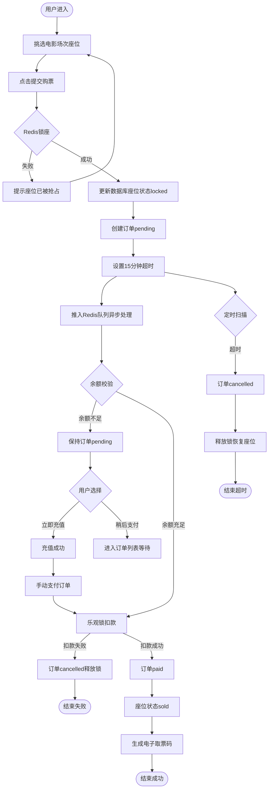

# 订单系统流程图

## 完整流程

## 状态说明

| 状态 | 含义 | 触发条件 |
|------|------|----------|
| pending | 待支付 | 订单创建后 |
| paid | 已支付 | 支付成功 |
| cancelled | 已取消 | 超时或支付失败 |
| refunded | 已退款 | 用户退票 |

## 核心机制

1. **锁座**：Redis Lua 原子操作，15分钟TTL
2. **异步下单**：Redis Stream 削峰，乐观锁扣款
3. **超时取消**：定时任务扫描加Redis过期键双重保障
4. **座位持久化**：数据库记录locked和sold状态
5. **取票码**：支付成功后生成TK加8位随机码
