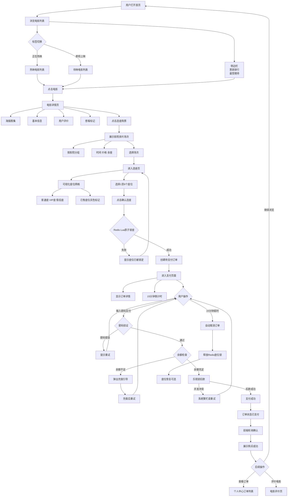

# 电影票在线预订系统 — 软件工程综合实训设计报告

> **提示：本文档参照软件工程教材规范撰写，包含数据流图(DFD)、E-R图、功能结构图、系统流程图等核心设计内容。**

---

# 1  绪论

## 1.1  研究背景

随着互联网技术的快速发展和普及，在线电影票务已经成为人们日常消费的重要组成部分。据统计，中国电影市场票房连续多年保持高速增长，2025年全国电影总票房突破600亿元，观影人次超过14亿。在线票务渗透率已超过85%，成为主流的观影消费方式。

然而，传统的线下购票方式仍然存在诸多问题：用户需要提前到影院排队购票，热门场次座位供不应求，选座信息不透明导致用户体验差，影院排片管理依赖人工操作效率低下。尤其是在节假日黄金时段，购票排队和抢座冲突问题更为突出。

针对上述痛点，开发一套集在线选座、实时锁座、虚拟支付、影院管理于一体的电影票在线预订系统具有重要的现实意义。本系统采用前后端分离架构，利用Redis原子性操作解决高并发场景下的座位抢占问题，通过异步消息队列实现订单处理，为用户提供流畅便捷的购票体验，为影院管理者提供高效的运营工具。

## 1.2  研究目的和意义

本设计旨在构建一个功能完备、性能可靠的电影票在线预订系统，主要目的包括：

1. **解决高并发选座冲突问题**：通过Redis Lua脚本实现原子性锁座，保证同一座位在同一时刻只能被一个用户锁定，避免传统数据库锁带来的性能瓶颈。
2. **实现流畅的购票流程**：从电影浏览、场次查询、在线选座到虚拟支付，构建端到端的购票闭环，提升用户购票效率。
3. **提供影院运营管理工具**：为影院管理者提供电影排片、影厅管理、票房统计等功能，降低运营成本。
4. **保障交易安全与数据一致性**：通过乐观锁、JWT认证、BCrypt密码加密等机制，确保系统安全和数据可靠。

对于用户而言，系统能够帮助其随时随地查询电影信息、在线选座购票，节省排队时间；对于影院管理者而言，系统实现了自动化排片管理、订单追踪和数据分析，提升运营效率；对于开发者而言，系统展示了高并发场景下的典型解决方案，具有较高的技术参考价值。

## 1.3  技术平台选择

本系统采用B/S架构，基于前后端分离模式进行开发，具体技术选型如下：

**前端技术栈**：
- Vue 3 框架（Composition API + `<script setup>` 语法）
- Vite 构建工具（开发服务器代理转发API请求）
- Element Plus UI组件库（对话框、分页、输入框、选择器、日期选择器、上传等组件）
- Pinia 状态管理（用户认证、电影、影院、场次、订单状态管理）
- ECharts 图表库（管理员统计仪表盘可视化）
- Vue Router 路由管理

**后端技术栈**：
- Spring Boot 3.2.5 框架
- Spring Data JPA / Hibernate ORM（数据库操作，`ddl-auto: update` 自动建表）
- MySQL 8.0 关系型数据库
- Redis 7.x（座位锁定 + 订单消息队列 + 票房缓存 + 想看计数）
- JWT (jjwt 0.12.5) 用户认证（HS256签名，7天过期）
- BCrypt (spring-security-crypto) 密码加密
- Jakarta Validation 参数校验
- Spring Scheduling 定时任务

**开发与部署环境**：
- Java 17 + Maven 3.8+
- Node.js 18+ + npm
- 服务端口：后端8080，前端5173（开发模式）
- Context-path：`/api`（所有接口和静态资源前缀）

---

# 2  可行性分析

## 2.1  技术可行性

本系统所采用的技术栈均为业界成熟的主流技术，具备充分的技术可行性：

- **Vue 3 + Element Plus**：Vue 3是当前最流行的前端框架之一，拥有庞大的社区和完善的文档。Element Plus作为成熟的UI组件库，提供了丰富的表单、表格、对话框等组件，能够满足本系统前端开发需求。
- **Spring Boot 3.2.5**：Spring Boot是Java生态中最成熟的企业级开发框架，内置Tomcat服务器，提供自动配置、依赖管理等开箱即用的功能，极大简化了后端开发。
- **MySQL 8.0**：关系型数据库的经典选择，支持事务（ACID）、外键约束、索引优化等关键特性，能够满足电影票预订对数据一致性的严格要求。
- **Redis**：高性能内存数据库，支持Lua脚本原子性操作、键过期策略、发布订阅等特性，是解决高并发座位锁定问题的理想方案，同时也是订单消息队列和缓存的优秀选择。
- **JWT认证**：无状态认证机制，服务端无需维护Session，天然适合前后端分离架构，配合HTTP拦截器可实现细粒度的权限控制。

综上所述，在技术层面本系统完全可行。

## 2.2  经济可行性

本系统的开发与运维成本极低：

- **开发工具**：所有开发工具均为开源免费（IntelliJ IDEA Community版、VS Code、Git等）。
- **技术栈**：全部采用开源框架和数据库（Spring Boot、Vue 3、MySQL、Redis），无需支付软件许可费用。
- **服务器成本**：系统为单体架构，数据库和缓存可部署于同一台服务器，校内服务器或低配云主机即可满足需求。
- **维护成本**：采用标准化的RESTful API设计，代码结构清晰，Spring Data JPA自动管理数据库变更，维护工作量小。

因此，在经济层面本系统完全可行。

## 2.3  操作可行性

- **用户端**：界面设计参考主流在线票务平台（猫眼、淘票票等），操作流程符合用户习惯。选座界面采用影院座位网格可视化设计，支付流程模拟微信支付密码界面，用户无需额外学习即可上手。
- **管理端**：左侧固定侧边栏导航，六大功能模块清晰划分，采用表格+对话框的经典CRUD操作模式，管理员可快速完成电影管理、排片管理、影院管理等日常运营工作。
- **响应式设计**：所有页面均适配平板（768px）和手机（480px）端，满足不同设备的使用需求。

---

# 3  需求分析

## 3.1  功能需求

### 3.1.1  用户端功能（3大模块）

| 模块 | 功能项 | 描述 |
|------|--------|------|
| **1. 用户模块** | 注册 | 填写用户名、手机号、密码完成注册，注册即送1000元虚拟钱包余额 |
| | 登录 | 用户名+密码登录，登录后获取JWT Token（7天有效） |
| | 个人中心 | 查看/修改个人资料（头像、昵称），修改密码，查看钱包余额 |
| | 钱包充值 | 输入充值金额和支付密码，充值虚拟钱包 |
| | 消息通知 | 顶部铃铛图标展示未读通知数，下拉弹窗查看最近通知，点击查看通知详情 |
| **2. 电影模块** | 电影列表 | 分页展示电影，支持"正在热映"/"即将上映"标签切换，关键词搜索 |
| | 电影详情 | 查看电影海报图集、基本信息、剧情简介、用户评分 |
| | 票房排行 | 首页侧边栏展示今日票房/累计票房排行榜（标签切换），以及近期最受期待电影 |
| | 想看功能 | 用户可标记想看的电影，排行榜实时更新 |
| | 影院列表 | 分页展示影院，支持名称/地址搜索 |
| | 影院详情 | 查看影院基本信息及该影院所有电影的排片场次 |
| | 电影评价 | 1-10分打分，可选500字文字评价，分页查看评价列表 |
| **3. 订单模块** | 场次查询 | 按电影/影院/日期查询场次，按影院分组展示 |
| | 在线选座 | 可视化座位网格，实时显示已售/可选状态，支持普通座/VIP座/情侣座 |
| | 锁座下单 | 调用Redis Lua原子锁座（15分钟TTL），确认后创建待支付订单 |
| | 虚拟钱包支付 | 输入支付密码完成支付，钱包余额不足时可充值后重试 |
| | 状态轮询 | 前端轮询订单处理状态（2秒间隔，最多20次），超时自动取消释放座位 |
| | 订单管理 | 查看全部/已支付/待支付/已取消订单列表，查看订单详情，取消已支付订单按阶梯费率退款至钱包 |

### 3.1.2  管理员端功能（3大模块）

| 模块 | 功能项 | 描述 |
|------|--------|------|
| **4. 内容管理模块** | 电影CRUD | 新增/编辑/删除电影，支持海报上传 |
| | 影院CRUD | 新增/编辑/删除影院信息 |
| | 影厅管理 | 在影院下管理影厅（新增/编辑/删除），设置座位排布和类型 |
| | 场次管理 | 新增/删除场次，级联选择电影→影院→影厅，支持批量排片 |
| **5. 订单管理模块** | 订单查看 | 查看所有用户订单，按状态筛选，查看订单详情 |
| **6. 系统管理模块** | 用户管理 | 查看/编辑用户信息，禁用/启用用户，修改角色和钱包余额 |
| | 数据统计 | 仪表盘：今日订单数/营业额、7天趋势图（双Y轴）、票房TOP10、想看TOP10 |

### 3.1.3  数据流图 (DFD)

> **此处插入顶层数据流图**

[预留位置 — 图3-1 顶层数据流图]

> **此处插入0层数据流图**

[预留位置 — 图3-2 0层数据流图]

> **此处插入1层数据流图（选座购票模块细分）**

[预留位置 — 图3-3 1层数据流图 — 选座购票模块细分]


## 3.2  性能需求

| 性能指标 | 要求 |
|---------|------|
| 响应时间 | 普通查询请求响应时间不超过500ms；锁座操作响应时间不超过1s |
| 并发处理 | 同一场次支持至少50个用户同时选座，锁座不冲突 |
| 数据一致性 | 同一座位保证不会超售，支付操作保证资金不丢失 |
| JWT认证 | Token校验延迟不超过50ms |
| 缓存刷新 | 票房数据每5分钟刷新一次，减少数据库查询压力 |
| 定时任务 | 订单超时扫描每60秒执行一次，及时回收过期座位 |

## 3.3  可靠性和可用性需求

- **系统可用性**：7×24小时运行，计划内维护时间不超过2小时/月。
- **数据可靠性**：每日备份MySQL数据库，Redis关键数据持久化（AOF + RDB双写）。
- **异常恢复**：服务异常重启后，JWT Token不受影响（无状态），Redis中未过期的锁座数据自动恢复。
- **事务保障**：支付操作使用数据库事务+乐观锁，确保资金操作原子性。
- **幂等性**：锁座操作使用Lua脚本保证原子性，同一个人重复锁同一座位自动拒绝。

## 3.4  出错处理需求

| 错误场景 | 处理方式 |
|---------|---------|
| 用户登录失败 | 提示"用户名或密码错误"，不清空表单 |
| 座位已被锁定 | 提示"该座位已被其他用户锁定"，刷新座位状态 |
| 锁座超时 | 订单自动取消，Redis锁自动过期（15分钟TTL），座位释放 |
| 支付余额不足 | 弹出充值引导界面，支持立即充值后继续支付 |
| 页面数据加载失败 | 显示"网络异常，请稍后重试"提示，支持手动刷新 |
| API请求401 | 自动清除Token并跳转登录页 |
| 服务器内部错误 | 记录错误日志，返回统一500错误响应，前端显示通用错误提示 |

## 3.5  接口需求

系统采用RESTful API设计规范，所有接口前缀为 `/api`，统一响应格式为：

```json
{
  "code": 200,
  "message": "success",
  "data": { ... }
}
```

认证方式：登录接口返回JWT Token，其他需要认证的接口在请求头中携带 `Authorization: Bearer {token}`。

接口按模块划分如下（共45个接口）：

| 模块 | 路径前缀 | 接口数 | 认证要求 |
|------|---------|--------|---------|
| 用户 | `/user` | 6 | 注册/登录无需认证，其余需JWT |
| 电影 | `/movie` | 5 | 想看需JWT，其余公开 |
| 影院 | `/cinema` | 1 | 无需认证 |
| 场次 | `/showtime` | 3 | 无需认证 |
| 订单 | `/order` | 8 | 需JWT |
| 评价 | `/review` | 3 | 发表需JWT，查看可选认证 |
| 票房 | `/box-office` | 1 | 无需认证 |
| 文件上传 | `/upload` | 1 | 需JWT |
| 通知 | `/notification` | 3 | 需JWT |
| 管理员 | `/admin` | 14 | 需JWT + 管理员角色 |

## 3.6  系统流程图

系统流程图用图形化的符号来记录整个系统各个模块之间的关系和结构，描述数据、相关文件和各子系统之间的关系，方便全面了解系统业务处理的概况。

> **此处插入系统流程图**

[预留位置 — 图3-4 系统流程图]



**核心业务流程说明（按系统流程图步骤）**：

1. 用户打开首页，浏览正在热映/即将上映的电影列表，可通过搜索框或侧边栏票房排行、最受期待排行发现感兴趣的电影。
2. 进入电影详情页查看海报图集、基本信息、剧情简介和用户评价，点击"选座购票"按钮。
3. 系统展示该电影所有影院的排片场次（按影院分组，显示时间、价格、余座数），用户选择场次后进入选座页面。
4. 系统展示实时座位状态网格：绿色=可选普通座、橙色=VIP座、粉色=情侣座、灰色=已售/锁定。用户选择1-6个座位后点击"确认选座"。
5. 后端通过Redis Lua脚本原子性锁定座位（15分钟TTL），成功则创建待支付订单并返回lockToken；失败则提示"座位已被锁定"，用户重新选择。
6. 锁座成功后进入支付页面，展示订单详情和15分钟倒计时。
7. 用户输入支付密码，系统验证密码后使用乐观锁（@Version）扣减钱包余额，创建支付记录，更新订单状态为已支付。
   - 若密码错误：提示重试。
   - 若余额不足：弹出充值引导，充值后继续支付。
   - 若乐观锁冲突：提示"系统繁忙，请重试"。
8. 支付成功后前端每2秒轮询订单状态（最多20次），确认后展示购买成功页面。
9. 若15分钟内未完成支付，定时任务（60秒扫描）自动将订单标记为取消并释放Redis座位锁，座位恢复可选。

**流程关键节点对照**：

| 节点 | 技术实现 | 关键点 |
|------|---------|--------|
| 锁座 | Redis Lua脚本 | 两阶段原子操作（检查+锁定），15分钟TTL自动释放 |
| 下单 | JPA事务 + Redis List队列 | 订单持久化 + 异步消息推送 |
| 支付 | BCrypt密码验证 + @Version乐观锁 | 防止并发超扣，冲突回滚提示重试 |
| 超时回收 | @Scheduled 60秒扫描 | 自动取消pending订单 + 删除Redis座位锁 |
| 状态确认 | 前端2秒×20次轮询 | GET /order/status/{orderNo} 直至终态 |

---

# 4  总体设计

> **本部分涉及软件总体结构、数据库设计、接口设计等内容（参见教材），可用到E-R图、层次方框图、HIPO图等。**

## 4.1  基本设计概念和处理流程

### 4.1.1  基本设计概念

本设计是实现一个面向广大电影观众的在线电影票预订系统，用户群体覆盖普通观众和影院管理者。系统开发的目的是打造一个集电影信息浏览、在线选座购票、虚拟支付、影院运营管理于一体的综合性平台，为观众提供便捷的一站式观影消费体验，为影院运营者提供高效的数字化管理工具。

系统核心业务流程围绕"选座→锁座→下单→支付"展开：

- **选座阶段**：用户通过电影详情页进入场次选择，系统展示该场次所有影院的排片信息。用户选定场次后进入可视化座位网格界面，系统通过不同颜色标识座位的实时状态（可选/已售/不同类型），用户可自由选择1-6个座位。
- **锁座阶段**：用户确认选座后，后端调用Redis Lua脚本对所有目标座位进行原子性检查和锁定。Lua脚本分两阶段执行：先检查所有座位键是否已存在（是否被他人锁定），再批量SETEX设置座位锁（key=`seat:lock:{showtimeId}:{seatId}`, value=userId, TTL=900秒）。这种原子操作确保了高并发场景下不会出现超售。
- **下单阶段**：锁座成功后，系统创建待支付订单（状态=pending），生成唯一订单号，将订单消息推入Redis List队列，由异步消费者在500ms间隔内处理确认。前端进入支付页面并展示15分钟倒计时。
- **支付阶段**：用户通过仿真支付密码界面完成支付。后端使用乐观锁（@Version字段）扣减用户钱包余额，创建支付记录，更新订单状态为已支付。若余额不足，用户可进行充值后继续支付。若15分钟内未完成支付，定时任务自动取消订单并释放Redis座位锁。

### 4.1.2  核心数据流分析

选座购票模块的详细数据流描述如下：

1. **获取场次座位信息**：前端请求 `GET /showtime/{id}/seats`，后端查询该场次关联的影厅所有座位，结合已售座位（查询已支付订单关联的座位）和Redis中正在锁定的座位，返回座位可用状态网格。
2. **锁定座位（原子操作）**：前端请求 `POST /order/lock`（参数：showtimeId、seatIds、userId），后端：① 构建Redis Key列表 → ② 执行Lua脚本原子检查+锁定 → ③ 返回lockToken和座位价格明细。
3. **创建订单**：前端请求 `POST /order/create`（参数：lockToken、seatIds等），后端：① 验证lockToken → ② 创建Order（pending状态）和OrderSeat记录 → ③ 推送订单号到Redis队列 `order:queue`。
4. **异步支付处理**：`OrderStreamConsumer` 轮询Redis队列（500ms间隔），取出订单后：① 扣减钱包余额（乐观锁）→ ② 创建Payment记录 → ③ 更新Order状态为paid。
5. **订单状态轮询**：前端每2秒调用 `GET /order/status/{orderNo}`，直到状态变为paid/refunded或超时。

## 4.2  软件功能总体结构

系统按业务内聚性划分为六大模块：用户端包含用户模块、电影模块、订单模块三个模块，管理端包含内容管理模块、订单管理模块、系统管理模块三个模块。

> **此处插入功能结构图**

[预留位置 — 图4-1 功能结构图（层次方框图/HIPO图）]

各模块功能阐述：

- **用户模块（用户端）**：负责用户注册、登录认证（JWT）、个人资料管理（头像、昵称、手机号）、密码修改（需验证旧密码）、钱包充值。支持session自动恢复。

- **电影模块（用户端）**：负责电影列表展示（分页+状态筛选+关键词搜索）、电影详情查看（含海报图集）、影院列表展示与详情查看（含排片信息）、今日票房排行（Redis缓存，5分钟刷新）、最受期待电影排行、想看功能（Redis Set存储，每小时同步至MySQL）、电影评分与文字评价（1-10分，分页评价列表，自动重算平均分）。

- **订单模块（用户端，核心）**：负责场次列表查询（按电影/影院/日期筛选，按影院分组返回）、座位状态实时查询（可视化网格）、Redis Lua原子锁座（15分钟TTL）、订单创建、虚拟钱包支付（密码验证+乐观锁扣款）、余额充值、订单状态轮询、订单列表查询（按状态筛选）、订单详情查看、订单取消与阶梯费率退款（退票预览→确认→按距开场时间阶梯收费）。

- **内容管理模块（管理端）**：负责电影CRUD管理（含海报上传）、影院CRUD管理、影厅CRUD管理（含座位排布设置）、场次管理（含批量创建/删除），涵盖所有业务资源的后台维护。

- **订单管理模块（管理端）**：负责查看所有用户订单、按状态筛选、查看订单详情。

- **系统管理模块（管理端）**：负责用户管理（查看/编辑用户信息、禁用/启用、修改角色和钱包余额）、数据统计仪表盘（今日订单数/营业额、7天趋势双Y轴折线图、票房TOP10柱状图、想看TOP10柱状图）。

## 4.3  功能需求与程序的关系

系统的功能需求与程序模块的关系如下表所示：

**表4-1 功能需求与程序模块的关系表（合并后6模块）**

| 模块 | 查询 | 新增 | 编辑 | 删除 | 登录 | 注册 | 选座 | 支付 |
|------|:----:|:----:|:----:|:----:|:----:|:----:|:----:|:----:|
| 用户模块 | √ | √ | √ | | √ | √ | | |
| 电影模块 | √ | √ | √ | √ | | | | |
| 订单模块 | √ | √ | | √ | | | √ | √ |
| 内容管理模块 | √ | √ | √ | √ | | | | |
| 订单管理模块 | √ | | | | | | | |
| 系统管理模块 | √ | √ | √ | √ | | | | |

## 4.4  运行设计

### 4.4.1  运行模块组合

（1）用户使用用户名和密码注册/登录账号，对个人资料（头像、昵称、手机号）进行查询修改、修改密码、查看钱包余额和充值等操作都会运行用户模块。

（2）用户浏览电影列表、查看电影详情和海报图集、搜索电影、浏览影院列表和详情、查看票房排行和最受期待电影、标记/取消想看、对电影打分和发表评价、查看评价列表等操作都会运行电影模块。

（3）用户查看场次信息、查询座位实时状态、选座锁座、创建订单、支付订单、轮询订单状态、查看订单列表和详情、取消订单等操作都会运行订单模块。

（4）管理员进行电影、影院、影厅、场次的新增/编辑/删除等后台资源管理操作都会运行内容管理模块。

（5）管理员查看所有用户订单、按状态筛选、查看订单详情等操作都会运行订单管理模块。

（6）管理员查看/编辑用户信息、禁用/启用用户、查看数据统计仪表盘（今日数据、7天趋势、票房和想看排行榜）等操作都会运行系统管理模块。

### 4.4.2  运行控制

**表4-2 运行控制表**

| 运行控制 | 控制方法 |
|---------|---------|
| 用户注册 | 用户填写用户名（唯一）、手机号、密码（BCrypt加密），注册成功后自动登录并赠送1000元虚拟钱包余额 |
| 用户登录 | 用户输入用户名和密码，后端验证BCrypt哈希值，验证通过后返回JWT Token（7天有效），前端将Token和用户信息存入localStorage |
| 修改个人信息 | 用户必须已登录；只能修改本人的个人信息（通过JWT Token中的userId校验） |
| 浏览电影列表 | 无需登录，支持正在热映/即将上映标签切换、关键词模糊搜索、分页 |
| 查看电影详情 | 无需登录，展示海报图集、基本信息、剧情简介、评分和用户评价 |
| 选座购票 | 用户必须已登录；同一场次最多选6个座位；座位通过Redis Lua脚本原子锁定15分钟 |
| 支付订单 | 用户必须已登录且为订单所属人；需输入支付密码验证身份；钱包余额不足时可充值后重试 |
| 取消订单 | 用户必须已登录且为订单所属人；仅已支付订单可取消；退票前先预览手续费和实际退款金额，确认后按阶梯费率退款至钱包（距开场>24h免手续费，2-24h收5%，30min-2h收20%，<30min收50%，已开场不可退） |
| 电影评价 | 用户必须已登录；仅能评价已观看的电影（从订单关联判断）；每个电影仅能发表一条评价 |
| 管理员登录 | 必须使用管理员账号登录；管理员登录后只能访问管理端页面，不能访问普通用户页面 |
| 后台管理操作 | 必须为管理员角色（role=admin）；后端接口双重校验JWT Token和用户角色 |
| 数据统计 | 管理员登录后查看仪表盘：今日订单数/营业额、7天趋势图（双Y轴折线图）、票房TOP10柱状图、想看TOP10柱状图 |

## 4.5  数据库设计

### 4.5.1  概念结构设计 — E-R图

系统共有12个核心实体，划分为4个业务域：

- **用户与认证域**：用户（Users）
- **电影与排片域**：电影（Movies）、电影图片（MovieImages）、影院（Cinemas）、影厅（Halls）、场次（Showtimes）、座位（Seats）
- **订单与支付域**：订单（Orders）、订单座位（OrderSeats）、支付（Payments）
- **交互域**：评价（Reviews）、通知（Notifications）

> **此处插入E-R图**

[预留位置 — 图4-2 E-R图]

**E-R关系说明**：
- 用户与订单之间：一对多关系。一个用户可以创建多个订单，每个订单属于一个用户。
- 场次与订单之间：一对多关系。一个场次可以有多个订单，每个订单对应一个场次。
- 订单与座位之间：多对多关系。通过订单座位关联表（order_seats）实现，一个订单可包含多个座位，一个座位在不同场次中可能属于不同订单。
- 影院与影厅之间：一对多关系。一个影院包含多个影厅，每个影厅属于一个影院。
- 影厅与座位之间：一对多关系。一个影厅包含多排多列座位，每个座位属于一个影厅。
- 电影与场次之间：一对多关系。一部电影可以有多个场次，每个场次对应一部电影。
- 影厅与场次之间：一对多关系。一个影厅可以排多场电影，每场次在一个影厅放映。
- 电影与电影图片之间：一对多关系。一部电影可以有多张图片（海报/剧照/Banner）。
- 电影与评价之间：一对多关系。一部电影可以有多条用户评价。
- 用户与评价之间：一对多关系。一个用户可以发表多条评价。

### 4.5.2  实体属性图

> **此处插入各实体属性图（用户、电影、订单等）**

[预留位置 — 图4-3至图4-14 各实体属性图]

### 4.5.3  逻辑设计 — CDM 和 PDM

> **此处插入CDM（概念数据模型）和PDM（物理数据模型）图**

[预留位置 — CDM/PDM模型图]

### 4.5.4  物理设计 — MySQL数据库表

系统使用MySQL 8.0数据库，数据库名称为 `movie_ticket`，字符集为 `utf8mb4`，共12张数据表。

**表4-3 用户表（users）**

| 字段名 | 别名 | 类型 | 长度 | 约束 |
|--------|------|------|------|------|
| id | 用户ID | bigint | | 主键，自增，非空 |
| username | 用户名 | varchar | 50 | 唯一，非空 |
| password | 密码 | varchar | 255 | 非空（BCrypt加密） |
| phone | 手机号 | varchar | 20 | |
| role | 角色 | enum | | 非空，'user'或'admin'，默认'user' |
| wallet_balance | 钱包余额 | decimal | 10,2 | 非空，默认1000.00 |
| version | 版本号 | int | | 非空，乐观锁字段 |
| status | 状态 | enum | | 非空，'active'或'disabled'，默认'active' |
| avatar | 头像 | varchar | 255 | |
| created_at | 创建时间 | datetime | | 非空，自动设置 |
| updated_at | 更新时间 | datetime | | 非空，自动更新 |

**表4-4 电影表（movies）**

| 字段名 | 别名 | 类型 | 长度 | 约束 |
|--------|------|------|------|------|
| id | 电影ID | bigint | | 主键，自增，非空 |
| title | 电影名称 | varchar | 200 | 非空 |
| duration | 时长(分钟) | int | | |
| release_date | 上映日期 | date | | |
| rating | 平均评分 | decimal | 3,1 | 默认0.0 |
| rating_count | 评分人数 | int | | 默认0 |
| wish_count | 想看人数 | int | | 默认0 |
| description | 剧情简介 | text | | |
| genre | 类型 | varchar | 200 | |
| director | 导演 | varchar | 100 | |
| actors | 演员 | varchar | 500 | |
| poster | 海报URL | varchar | 255 | |
| status | 状态 | enum | | 'upcoming'/'showing'/'ended' |
| created_at | 创建时间 | datetime | | 非空 |
| updated_at | 更新时间 | datetime | | 非空 |

**表4-5 电影图片表（movie_images）**

| 字段名 | 别名 | 类型 | 长度 | 约束 |
|--------|------|------|------|------|
| id | 图片ID | bigint | | 主键，自增，非空 |
| movie_id | 电影ID | bigint | | 外键→movies.id，级联删除 |
| image_url | 图片URL | varchar | 255 | 非空 |
| image_type | 图片类型 | enum | | 'poster'/'still'/'banner' |
| sort_order | 排序 | int | | 默认0 |
| is_cover | 是否封面 | boolean | | 默认false |
| created_at | 创建时间 | datetime | | 非空 |

**表4-6 影院表（cinemas）**

| 字段名 | 别名 | 类型 | 长度 | 约束 |
|--------|------|------|------|------|
| id | 影院ID | bigint | | 主键，自增，非空 |
| name | 影院名称 | varchar | 200 | 非空 |
| address | 地址 | varchar | 500 | |
| phone | 联系电话 | varchar | 20 | |
| status | 状态 | enum | | 'open'/'suspended'/'preparing'/'closed' |
| business_hours | 营业时间 | varchar | 100 | |
| longitude | 经度 | decimal | 10,7 | |
| latitude | 纬度 | decimal | 10,7 | |
| created_at | 创建时间 | datetime | | 非空 |
| updated_at | 更新时间 | datetime | | 非空 |

**表4-7 影厅表（halls）**

| 字段名 | 别名 | 类型 | 长度 | 约束 |
|--------|------|------|------|------|
| id | 影厅ID | bigint | | 主键，自增，非空 |
| cinema_id | 影院ID | bigint | | 外键→cinemas.id，级联删除 |
| name | 影厅名称 | varchar | 50 | 非空 |
| seat_rows | 座位行数 | int | | |
| seat_cols | 座位列数 | int | | |
| hall_type | 影厅类型 | enum | | 'normal'/'imax'/'vip'/'threeD' |
| created_at | 创建时间 | datetime | | 非空 |
| updated_at | 更新时间 | datetime | | 非空 |

**表4-8 场次表（showtimes）**

| 字段名 | 别名 | 类型 | 长度 | 约束 |
|--------|------|------|------|------|
| id | 场次ID | bigint | | 主键，自增，非空 |
| movie_id | 电影ID | bigint | | 外键→movies.id，级联删除 |
| hall_id | 影厅ID | bigint | | 外键→halls.id，级联删除 |
| show_date | 放映日期 | date | | 非空 |
| show_time | 放映时间 | time | | 非空 |
| price | 基础票价 | decimal | 8,2 | |
| status | 状态 | varchar | 20 | 'normal'/'cancelled'/'sold_out' |
| created_at | 创建时间 | datetime | | 非空 |
| updated_at | 更新时间 | datetime | | 非空 |

**表4-9 座位表（seats）**

| 字段名 | 别名 | 类型 | 长度 | 约束 |
|--------|------|------|------|------|
| id | 座位ID | bigint | | 主键，自增，非空 |
| hall_id | 影厅ID | bigint | | 外键→halls.id，级联删除 |
| row_num | 行号 | int | | 非空 |
| col_num | 列号 | int | | 非空 |
| seat_type | 座位类型 | enum | | 'normal'/'vip'/'couple' |
| status | 状态 | enum | | 'active'/'maintenance' |
| created_at | 创建时间 | datetime | | 非空 |
| updated_at | 更新时间 | datetime | | 非空 |

> 约束：(hall_id, row_num, col_num) 联合唯一

**表4-10 订单表（orders）**

| 字段名 | 别名 | 类型 | 长度 | 约束 |
|--------|------|------|------|------|
| id | 订单ID | bigint | | 主键，自增，非空 |
| order_no | 订单编号 | varchar | 64 | 唯一，非空 |
| user_id | 用户ID | bigint | | 外键→users.id，级联删除 |
| showtime_id | 场次ID | bigint | | 外键→showtimes.id，级联删除 |
| total_amount | 订单金额 | decimal | 10,2 | |
| status | 状态 | enum | | 'pending'/'paid'/'refunded'/'cancelled' |
| remark | 备注 | varchar | 255 | |
| created_at | 创建时间 | datetime | | 非空 |
| updated_at | 更新时间 | datetime | | 非空 |

**表4-11 订单座位关联表（order_seats）**

| 字段名 | 别名 | 类型 | 长度 | 约束 |
|--------|------|------|------|------|
| id | ID | bigint | | 主键，自增，非空 |
| order_id | 订单ID | bigint | | 外键→orders.id，级联删除 |
| seat_id | 座位ID | bigint | | 外键→seats.id，级联删除 |
| price | 座位价格 | decimal | 8,2 | |

**表4-12 支付表（payments）**

| 字段名 | 别名 | 类型 | 长度 | 约束 |
|--------|------|------|------|------|
| id | 支付ID | bigint | | 主键，自增，非空 |
| order_id | 订单ID | bigint | | 外键→orders.id，级联删除 |
| user_id | 用户ID | bigint | | 外键→users.id，级联删除 |
| payment_method | 支付方式 | enum | | 'wallet'（仅支持钱包支付） |
| amount | 金额 | decimal | 10,2 | |
| fee | 手续费 | decimal | 10,2 | 默认0.00 |
| status | 状态 | enum | | 'success'/'failed'/'refunded' |
| created_at | 创建时间 | datetime | | 非空 |

**表4-13 评价表（reviews）**

| 字段名 | 别名 | 类型 | 长度 | 约束 |
|--------|------|------|------|------|
| id | 评价ID | bigint | | 主键，自增，非空 |
| user_id | 用户ID | bigint | | 外键→users.id，级联删除 |
| movie_id | 电影ID | bigint | | 外键→movies.id，级联删除 |
| order_id | 订单ID | bigint | | 外键→orders.id，SET NULL |
| rating | 评分 | int | | 1-10分 |
| content | 评价内容 | text | | |
| created_at | 创建时间 | datetime | | 非空 |

**表4-14 通知表（notifications）**

| 字段名 | 别名 | 类型 | 长度 | 约束 |
|--------|------|------|------|------|
| id | 通知ID | bigint | | 主键，自增，非空 |
| user_id | 用户ID | bigint | | 外键→users.id，级联删除 |
| title | 标题 | varchar | 200 | 非空 |
| content | 内容 | text | | |
| type | 类型 | enum | | 'order'/'system' |
| status | 状态 | enum | | 'unread'/'read' |
| created_at | 创建时间 | datetime | | 非空 |

## 4.6  系统出错处理设计

### 4.6.1  出错信息

（1）用户登录失败：提示用户"用户名或密码错误"，无法进入首页。

（2）注册用户名已存在：提示用户"该用户名已被注册，请更换"，注册表单不清空。

（3）座位锁定失败：提示用户"该座位已被其他用户锁定"，自动刷新座位状态，引导用户重新选择。

（4）支付密码错误：提示用户"支付密码错误，请重试"，不清空密码输入框。

（5）支付余额不足：提示用户"余额不足"，弹出充值引导对话框，支持立即充值后继续支付。

（6）各页面数据加载失败：提示用户"网络异常，请稍后重试"，提供手动刷新按钮。

（7）认证Token过期：自动清除本地Token并跳转至登录页，提示"登录已过期，请重新登录"。

（8）无权限访问：管理员页面被普通用户访问时跳转至登录页；用户页面被管理员访问时强制跳转至后台首页。

### 4.6.2  补救措施

（1）后备：使用MySQL数据库的日志文件（binlog）实现增量备份，备份频率为每日一次全量备份。Redis开启AOF持久化（每秒fsync），确保缓存数据不丢失。

（2）恢复及再启动：如果MySQL数据造成丢失，可使用最近一次全量备份+binlog进行数据恢复。Redis重启后AOF文件自动加载重建缓存。

（3）订单超时自动恢复：系统定时任务每60秒扫描超过15分钟仍未支付的订单，自动将其标记为已取消并释放Redis座位锁。即使服务崩溃重启，Redis中锁座Key的15分钟TTL也能保证座位不会永久锁定。

（4）乐观锁冲突重试：钱包余额扣减使用乐观锁（version字段），若发生并发冲突，由应用层捕获OptimisticLockException后提示用户重试或走正常超时回收流程。

---

# 5  详细设计

> **本部分是过程设计，对某个模块进行设计，不要只提供运行界面。要有分析、阐述、流程图等。可以用程序伪代码、判定树、判定表等工具来描述。**

## 5.1  程序的系统结构

本系统从底至上分别为运行环境层、持久层、基础应用模块层、业务层、接口层、应用层，系统结构如图：

> **此处插入系统结构图**

[预留位置 — 图5-1 系统结构图]

**各层说明**：

- **运行环境层**：MySQL 8.0、Redis 7.x、JDK 17、Node.js 18+，为系统提供数据存储、缓存和运行环境。
- **持久层**：Spring Data JPA Repository接口 + Hibernate ORM，负责实体与数据库表的映射，提供CRUD操作和自定义查询。包含12个Repository接口对应12张数据库表。
- **基础应用模块层**：JWT工具（token生成/解析/校验）、订单号生成器（ORD+时间戳+序号）、BCrypt密码加密器、Redis Lua脚本引擎、文件上传服务。
- **业务层**：10个Service类（UserService、MovieService、CinemaService、ShowtimeService、OrderService、ReviewService、AdminService、NotificationService、BoxOfficeService、UploadService），封装核心业务逻辑。
- **接口层**：10个Controller类 + 2个拦截器（JwtInterceptor硬认证、SoftAuthInterceptor软认证），对外暴露43个RESTful API接口。
- **应用层**：Vue 3前端应用，16个页面视图 + 6个公共组件 + 5个Pinia状态存储，提供用户端和后台管理端双端界面。

## 5.2  选座购票模块详细设计（核心模块）

### 5.2.1  需求描述

选座购票模块是电影票预订系统的核心业务流程模块，承担着从用户选定场次到完成支付的全链路处理职责。该模块需要在保证数据一致性的前提下，解决高并发场景下的座位抢占冲突问题，同时提供流畅的用户体验。模块需要处理的关键问题包括：同一座位在同一时刻只能被一个用户锁定、锁座超时自动释放、支付操作的原子性保障、订单状态的可追溯性。

### 5.2.2  功能拆分

（1）座位状态查询：用户选定场次后，查询该场次对应影厅的所有座位及其状态（可选/已锁定/已售），按座位网格返回。
（2）座位锁定：用户提交选中的座位列表，系统通过Redis Lua脚本原子性锁定所有座位，返回锁座结果和价格明细。
（3）订单创建：锁座成功后，创建待支付订单，生成唯一订单号，推入Redis消息队列进行异步处理。
（4）订单支付：用户输入支付密码，系统验证身份后从钱包扣款，创建支付记录，更新订单状态。
（5）订单状态轮询：前端定时轮询订单最新状态，处理支付成功/失败/超时等不同终态。
（6）超时回收：系统定时扫描超时未支付订单，自动取消并释放Redis座位锁。

### 5.2.3  流程图

> **此处插入选座购票模块详细流程图**

[预留位置 — 图5-2 选座购票模块流程图]

### 5.2.4  程序伪代码

**Lua锁座脚本（lock_seats.lua）**：

```
-- KEYS: seat:lock:{showtimeId}:{seatId1}, seat:lock:{showtimeId}:{seatId2}, ...
-- ARGV[1]: userId
-- ARGV[2]: TTL (seconds)

-- Phase 1: 检查所有座位是否已被锁定
for i, key in ipairs(KEYS) do
    if redis.call('EXISTS', key) == 1 then
        return {0, key}  -- 锁定失败，返回冲突的key
    end
end

-- Phase 2: 全部未锁定，原子锁定所有座位
for i, key in ipairs(KEYS) do
    redis.call('SETEX', key, ARGV[2], ARGV[1])
end

return {1, ""}  -- 锁定成功
```

**后端锁座方法伪代码（SeatLockService.tryLockSeats）**：

```
function tryLockSeats(showtimeId, seatIds, userId):
    // 1. 验证输入
    if seatIds is empty or seatIds.size > 6:
        throw BusinessException("座位数不合法")
    
    // 2. 构建Redis Key列表
    keys = []
    for each seatId in seatIds:
        keys.add("seat:lock:" + showtimeId + ":" + seatId)
    
    // 3. 执行Lua脚本
    result = redisTemplate.execute(luaScript, keys, userId, 900)
    
    // 4. 处理结果
    if result[0] == 0:
        throw BusinessException("座位 " + result[1] + " 已被锁定")
    
    // 5. 记录用户锁座汇总（方便释放）
    userLockKey = "user:lock:" + userId
    redisTemplate.set(userLockKey, showtimeId + ":" + seatIds.join(","), 900)
    
    // 6. 计算价格并返回
    seatPrices = calculateSeatPrices(showtimeId, seatIds)
    totalAmount = sum(seatPrices)
    lockToken = generateLockToken(userId, showtimeId, seatIds)
    
    return {lockToken, seatPrices, totalAmount}
```

**订单创建方法伪代码（OrderService.createOrder）**：

```
function createOrder(userId, showtimeId, seatIds, lockToken, remark):
    // 1. 验证lockToken
    if not verifyLockToken(lockToken, userId, showtimeId, seatIds):
        throw BusinessException("锁座信息已失效，请重新选座")
    
    // 2. 再次确认座位未被他人锁定
    for each seatId in seatIds:
        lockKey = "seat:lock:" + showtimeId + ":" + seatId
        if redisTemplate.get(lockKey) != userId:
            throw BusinessException("座位已被他人抢占")
    
    // 3. 生成订单号并计算金额
    orderNo = OrderNoGenerator.generate()  // ORD + yyyyMMddHHmmss + 4位序号
    totalAmount = calculateTotalAmount(showtimeId, seatIds)
    
    // 4. 数据库事务：创建订单 + 订单座位关联
    begin transaction:
        order = new Order(
            orderNo, userId, showtimeId, totalAmount,
            status = OrderStatus.PENDING, remark
        )
        orderRepository.save(order)
        
        for each seatId in seatIds:
            price = calculateSeatPrice(showtimeId, seatId)
            orderSeat = new OrderSeat(order.id, seatId, price)
            orderSeatRepository.save(orderSeat)
    commit transaction
    
    // 5. 推入Redis消息队列异步处理
    message = orderNo + "|" + userId + "|" + showtimeId + "|" + seatIds + "|" + lockToken
    redisTemplate.opsForList().rightPush("order:queue", message)
    
    return {orderNo, totalAmount}
```

**订单支付方法伪代码（OrderService.payOrder）**：

```
function payOrder(userId, orderNo, password):
    // 1. 验证密码
    if not checkPassword(userId, password):
        throw BusinessException("支付密码错误")
    
    // 2. 查询订单
    order = orderRepository.findByOrderNo(orderNo)
    if order.userId != userId:
        throw AccessDenied("无权操作此订单")
    if order.status != OrderStatus.PENDING:
        throw BusinessException("订单状态不允许支付")
    
    // 3. 乐观锁扣款
    user = userRepository.findById(userId)
    if user.walletBalance < order.totalAmount:
        throw BusinessException("余额不足")
    
    try:
        rows = userRepository.deductBalance(userId, order.totalAmount, user.version)
        if rows == 0:
            throw OptimisticLockException("支付失败，请重试")
    catch OptimisticLockException:
        throw BusinessException("系统繁忙，请重试")
    
    // 4. 创建支付记录
    payment = new Payment(order.id, userId, PaymentMethod.WALLET,
                          order.totalAmount, PaymentStatus.SUCCESS)
    paymentRepository.save(payment)
    
    // 5. 更新订单状态
    order.status = OrderStatus.PAID
    orderRepository.save(order)
    
    // 6. 发送通知
    notificationService.createOrderPaidNotification(userId, orderNo)
    
    return "支付成功"
```

**订单超时回收伪代码（Scheduled Task）**：

```
@Scheduled(fixedDelay = 60000)  // 每60秒执行
function cancelExpiredOrders():
    expiredTime = now() - 15 minutes
    expiredOrders = orderRepository.findByStatusAndCreatedAtBefore(
        OrderStatus.PENDING, expiredTime)
    
    for each order in expiredOrders:
        begin transaction:
            // 1. 更新订单状态
            order.status = OrderStatus.CANCELLED
            orderRepository.save(order)
            
            // 2. 释放Redis座位锁
            for each orderSeat in orderSeatRepository.findByOrderId(order.id):
                lockKey = "seat:lock:" + order.showtimeId + ":" + orderSeat.seatId
                redisTemplate.delete(lockKey)
            
            // 3. 释放用户锁汇总
            userLockKey = "user:lock:" + order.userId
            redisTemplate.delete(userLockKey)
        commit transaction
```

### 5.2.5  判定表

**表5-1 锁座操作判定表**

| 条件/动作 | 规则1 | 规则2 | 规则3 | 规则4 |
|---------|:-----:|:-----:|:-----:|:-----:|
| 用户已登录 | Y | Y | Y | N |
| 所有座位均未被锁定 | Y | N | Y | - |
| 座位数 ≤ 6 | Y | Y | N | - |
| 座位属于同一场次 | Y | Y | Y | - |
| **动作** | | | | |
| 执行Redis Lua锁座 | √ | | | |
| 返回锁座成功+lockToken | √ | | | |
| 返回"座位已被锁定"错误 | | √ | | |
| 返回"座位数不合法"错误 | | | √ | |
| 返回"请先登录"错误 | | | | √ |

**表5-2 支付操作判定表**

| 条件/动作 | 规则1 | 规则2 | 规则3 | 规则4 | 规则5 |
|---------|:-----:|:-----:|:-----:|:-----:|:-----:|
| 订单状态为pending | Y | Y | Y | N | Y |
| 余额 ≥ 订单金额 | Y | Y | N | - | Y |
| 支付密码正确 | Y | N | - | - | N |
| 乐观锁version匹配 | Y | - | - | - | - |
| **动作** | | | | | |
| 扣款成功，订单→paid | √ | | | | |
| 返回"密码错误" | | √ | | | |
| 返回"余额不足" | | | √ | | |
| 返回"订单状态不允许" | | | | √ | |
| 返回"支付失败，请重试" | | | | | √ |

### 5.2.6  接口设计

选座购票模块核心接口设计如下：

**表5-3 获取座位信息接口**

| 描述 | 获取场次座位状态 |
|------|----------------|
| 地址 | `/api/showtime/{showtimeId}/seats` |
| 请求方式 | GET |
| 入参 | showtimeId（路径参数，场次ID） |
| 出参 | `{ rows, cols, seatGrid[row][col]: {seatId, seatType, status, price} }` |

**表5-4 锁座接口**

| 描述 | 锁定座位（Redis原子操作） |
|------|-------------------------|
| 地址 | `/api/order/lock` |
| 请求方式 | POST |
| 认证 | 需要JWT |
| 入参 | `{ showtimeId: Number, seatIds: Number[] }` |
| 出参 | `{ lockToken: String, seatPrices: [{seatId, seatType, price}], totalAmount: BigDecimal }` |
| 错误码 | 400: 座位数不合法; 409: 座位已被锁定; 401: 未登录 |

**表5-5 创建订单接口**

| 描述 | 创建订单（锁座后调用） |
|------|----------------------|
| 地址 | `/api/order/create` |
| 请求方式 | POST |
| 认证 | 需要JWT |
| 入参 | `{ showtimeId: Number, seatIds: Number[], lockToken: String, remark?: String }` |
| 出参 | `{ orderNo: String, totalAmount: BigDecimal }` |
| 错误码 | 400: lockToken无效或已过期; 409: 座位已被他人抢占 |

**表5-6 支付订单接口**

| 描述 | 钱包支付订单 |
|------|-------------|
| 地址 | `/api/order/pay/{orderNo}` |
| 请求方式 | POST |
| 认证 | 需要JWT |
| 入参 | `{ password: String }` |
| 出参 | `{ message: "支付成功" }` |
| 错误码 | 400: 密码错误/余额不足/状态不允许; 409: 乐观锁冲突 |

**表5-7 订单状态查询接口**

| 描述 | 轮询订单状态 |
|------|-------------|
| 地址 | `/api/order/status/{orderNo}` |
| 请求方式 | GET |
| 认证 | 需要JWT |
| 出参 | `{ orderNo, status, totalAmount, createdAt }` |

## 5.3  阶梯退票模块详细设计

### 5.3.1  需求描述

退票模块是订单模块的重要子功能，负责处理用户取消已支付订单并退款的业务。为平衡用户体验与运营成本，系统采用阶梯费率退票机制——根据退票时间距电影开场时间的远近，收取不同比例的手续费。距开场越近，手续费越高；已开场的电影不支持退票。

### 5.3.2  费率规则

**表5-8 阶梯退票费率表**

| 距离开场时间 | 手续费率 | 退款比例 | 示例（票价100元） |
|:----------:|:-----:|:------:|:--------------:|
| > 24 小时 | 0% | 100% | 退款 100.00 |
| 2 ~ 24 小时 | 5% | 95% | 退款 95.00 |
| 30 分钟 ~ 2 小时 | 20% | 80% | 退款 80.00 |
| < 30 分钟 | 50% | 50% | 退款 50.00 |
| 已开场（≤ 0 分钟） | — | 0% | 不可退票 |

### 5.3.3  业务流程

退票采用"预览→确认→执行"两步流程：

1. **退票预览**（GET `/order/cancel-preview/{orderNo}`）：用户点击取消按钮后，系统先返回退票明细供用户确认，包括电影名称、场次时间、距开场时长、原票价、手续费率、手续费金额、实际退款金额。此步骤只读，不修改任何数据。
2. **确认退票**（POST `/order/cancel/{orderNo}`）：用户确认后提交退票请求，系统重新计算费率（以实际执行为准），扣减手续费后退款至钱包，记录手续费至支付表，发送退票成功通知，清除票房缓存。

### 5.3.4  判定表

**表5-9 退票操作判定表**

| 条件/动作 | 规则1 | 规则2 | 规则3 | 规则4 | 规则5 | 规则6 |
|---------|:-----:|:-----:|:-----:|:-----:|:-----:|:-----:|
| 订单状态为paid | Y | Y | Y | Y | Y | N |
| 订单属于当前用户 | Y | Y | Y | Y | N | - |
| 距开场 > 24h | Y | N | N | N | - | - |
| 距开场 2h~24h | N | Y | N | N | - | - |
| 距开场 30min~2h | N | N | Y | N | - | - |
| 距开场 < 30min | N | N | N | Y | - | - |
| 已开场 | N | N | N | N | - | - |
| **动作** | | | | | | |
| 退款 100%，手续费 0% | √ | | | | | |
| 退款 95%，手续费 5% | | √ | | | | |
| 退款 80%，手续费 20% | | | √ | | | |
| 退款 50%，手续费 50% | | | | √ | | |
| 返回"无权操作" | | | | | √ | |
| 返回"状态不允许" | | | | | | √ |

### 5.3.5  程序伪代码

**费率计算（OrderService.calculateRefundBreakdown）**：

```
function calculateRefundBreakdown(order, showtime):
    // 1. 计算距开场分钟数
    showtimeDateTime = showtime.showDate + showtime.showTime
    minutesUntil = Duration.between(now(), showtimeDateTime).toMinutes()
    
    // 2. 开场后不可退
    if minutesUntil <= 0:
        throw BusinessException("该场次已开场，无法退票")
    
    // 3. 按阶梯确定费率
    if minutesUntil > 24 * 60:
        feeRate = 0
    else if minutesUntil > 2 * 60:
        feeRate = 0.05
    else if minutesUntil > 30:
        feeRate = 0.20
    else:
        feeRate = 0.50
    
    // 4. 计算手续费和退款金额
    fee = totalAmount * feeRate  // 保留2位小数，四舍五入
    refundAmount = totalAmount - fee
    
    return {totalAmount, feeRate, fee, refundAmount, minutesUntilShowtime}
```

**退票预览（OrderService.previewCancel）**：

```
function previewCancel(orderNo, userId):
    // 1. 查询订单并校验所有权
    order = orderRepository.findByOrderNo(orderNo)
    if order.userId != userId:
        throw AccessDenied("无权操作此订单")
    
    // 2. 仅已支付订单可退
    if order.status != PAID:
        throw BusinessException("订单状态不允许退票")
    
    // 3. 查询场次和电影信息
    showtime = showtimeRepository.findById(order.showtimeId)
    movie = movieRepository.findById(showtime.movieId)
    
    // 4. 计算退票明细（只读，不修改数据）
    breakdown = calculateRefundBreakdown(order, showtime)
    
    return {
        orderNo, totalAmount, status,
        movieTitle, showDate, showTime,
        feeRate, fee, refundAmount, minutesUntilShowtime
    }
```

**执行退票（OrderService.cancelOrder）**：

```
@Transactional
function cancelOrder(orderNo, userId):
    // 1-2. 校验所有权和状态（同previewCancel）
    order = orderRepository.findByOrderNo(orderNo)
    validateOwnershipAndStatus(order, userId)
    
    // 3. 查询场次并重新计算费率
    showtime = showtimeRepository.findById(order.showtimeId)
    breakdown = calculateRefundBreakdown(order, showtime)
    refundAmount = breakdown.refundAmount
    fee = breakdown.fee
    
    // 4. 退款到钱包（扣手续费后金额）
    userRepository.addBalance(userId, refundAmount)
    
    // 5. 更新订单状态
    order.status = REFUNDED
    orderRepository.save(order)
    
    // 6. 创建退款支付记录（含手续费）
    payment = new Payment(order.id, userId, WALLET, -refundAmount, REFUNDED)
    payment.fee = fee
    paymentRepository.save(payment)
    
    // 7. 清除票房缓存
    boxOfficeService.clearCache()
    
    // 8. 发送退票通知
    user = userRepository.findById(userId)
    notificationService.create(userId, "退票成功",
        "《" + movie.title + "》已退票，退款 ¥" + refundAmount +
        (fee > 0 ? "（手续费 ¥" + fee + "）" : ""),
        NotificationType.ORDER)
    
    return {orderNo, totalAmount, feeRate, fee, refundAmount, walletBalance}
```

### 5.3.6  接口设计

**表5-10 退票预览接口**

| 描述 | 预览退票明细（只读） |
|------|-------------------|
| 地址 | `/api/order/cancel-preview/{orderNo}` |
| 请求方式 | GET |
| 认证 | 需要JWT |
| 出参 | `{ orderNo, totalAmount, movieTitle, showDate, showTime, feeRate, fee, refundAmount, minutesUntilShowtime }` |
| 错误码 | 400: 订单状态不允许; 403: 无权操作 |

**表5-11 退票执行接口**

| 描述 | 确认退票并退款 |
|------|--------------|
| 地址 | `/api/order/cancel/{orderNo}` |
| 请求方式 | POST |
| 认证 | 需要JWT |
| 出参 | `{ orderNo, totalAmount, feeRate, fee, refundAmount, walletBalance }` |
| 错误码 | 400: 已开场不可退/状态不允许; 403: 无权操作 |

### 5.3.7  边界处理

| 场景 | 处理方式 |
|------|---------|
| 已开场场次退票 | 前后端均拦截，后端抛出"该场次已开场，无法退票" |
| 预览与执行间费率变化 | 后端执行时重新计算费率，以实际执行时刻为准 |
| 重复退票 | status=paid 检查拦截，已退票订单拒绝再次退票 |
| 并发退票 | @Transactional 保证退票+退款+记录持久化的原子性 |
| 旧数据兼容 | Payment.fee 字段默认值为 0，历史退款记录手续费显示为 0 |

---

# 6  测试

> **可用白盒和黑盒测试，写测试用例，测试用例！**

## 6.1  测试系统图

系统的测试将对用户模块、订单模块、支付模块、评价模块的核心功能进行测试。

> **此处插入测试系统图**

[预留位置 — 图6-1 测试系统图]

## 6.2  测试的方法

测试采用黑盒测试的等价类划分法。等价类划分是指某个输入域的子集合，在该子集合中各个输入数据对于揭露程序中的错误都是等效的，测试代表值就等价于这一类其他值的测试。测试用例包括测试数据、待测试功能、测试结果。

以下测试除登录模块外都基于当前用户已登录的前提进行。若用户未登录，将无法访问需要认证的页面和接口。

## 6.3  用户登录模块测试

### 6.3.1  用户名密码登录

登录功能的有效等价类和无效等价类如下表所示：

**表6-1 登录等价类表**

| 输入条件 | 有效等价类 | 编号 | 无效等价类 | 编号 |
|---------|-----------|------|-----------|------|
| 用户名 | 已注册的用户名，长度1-50字符 | E1 | 输入未注册的用户名 | E3 |
| | | | 用户名为空 | E4 |
| | | | 用户名长度超过50字符 | E5 |
| 密码 | 与用户名匹配的正确密码（BCrypt验证通过） | E2 | 输入错误密码 | E6 |
| | | | 密码为空 | E7 |
| | | | 密码长度超过255字符 | E8 |

由此等价类表导出的测试用例如下表所示（假设正确的用户名为 `testuser`，密码为 `123456`）：

**表6-2 登录测试用例表**

| 编号 | 用户名 | 密码 | 覆盖等价类 | 预期输出 |
|:----:|--------|------|:--------:|---------|
| U1 | testuser | 123456 | E1、E2 | 登录成功，返回JWT Token和用户信息，跳转首页 |
| U2 | testuser | 111111 | E1、E6 | 登录失败，提示"用户名或密码错误" |
| U3 | testuser | (空) | E1、E7 | 登录失败，提示"请输入密码" |
| U4 | nonexist | 123456 | E3、E2 | 登录失败，提示"用户名或密码错误" |
| U5 | (空) | 123456 | E4、E2 | 登录失败，提示"请输入用户名" |
| U6 | testuser | (255+字符) | E1、E8 | 登录失败，提示"密码过长" |

## 6.4  选座锁座模块测试

### 6.4.1  座位锁定

锁座功能的有效等价类和无效等价类如下表所示：

**表6-3 锁座等价类表**

| 输入条件 | 有效等价类 | 编号 | 无效等价类 | 编号 |
|---------|-----------|------|-----------|------|
| showtimeId | 存在的、未过期的场次ID | S1 | 不存在的场次ID | S4 |
| | | | 已过期的场次ID | S5 |
| seatIds | 1-6个未被锁定的座位ID（同场次） | S2 | 座位数为0 | S6 |
| | | | 座位数超过6个 | S7 |
| | | | 包含已被其他用户锁定的座位 | S8 |
| | | | 包含已售出的座位 | S9 |
| 用户状态 | 已登录，非禁用状态 | S3 | 未登录 | S10 |
| | | | 账号已被禁用 | S11 |

由此等价类表导出的测试用例如下表所示：

**表6-4 锁座测试用例表**

| 编号 | 输入 | 覆盖等价类 | 预期输出 |
|:----:|------|:--------:|---------|
| S1 | showtimeId=有效, seatIds=[A1,A2]（均未锁定） | S1、S2、S3 | 锁座成功，返回lockToken和价格明细 |
| S2 | showtimeId=有效, seatIds=[A1]（已被他人锁定） | S1、S8 | 锁座失败，提示"该座位已被其他用户锁定" |
| S3 | showtimeId=有效, seatIds=[A1,A2,A3,A4,A5,A6,A7]（7个座位） | S1、S7 | 锁座失败，提示"最多选择6个座位" |
| S4 | showtimeId=有效, seatIds=[] | S1、S6 | 锁座失败，提示"请选择座位" |
| S5 | showtimeId=99999（不存在）, seatIds=[A1] | S4 | 锁座失败，提示"场次不存在" |
| S6 | showtimeId=有效, seatIds=[B5]（B5已售出） | S1、S9 | 锁座失败，提示"该座位已售出" |
| S7 | 同一用户重复锁定已锁座位 | S1、S2 | 锁座成功（刷新锁座TTL），返回相同lockToken |
| S8 | 未登录调用锁座接口 | S10 | 返回401，提示"请先登录" |

### 6.4.2  订单创建

**表6-5 订单创建测试用例表**

| 编号 | 输入 | 预期输出 |
|:----:|------|---------|
| O1 | lockToken有效，所有座位的锁属于当前用户 | 创建成功，返回orderNo和totalAmount |
| O2 | lockToken已过期（超过15分钟）或无效 | 创建失败，提示"锁座信息已失效" |
| O3 | lockToken有效但座位已被他人重新锁定 | 创建失败，提示"座位已被他人抢占" |
| O4 | lockToken对应的showtimeId已过期 | 创建失败，提示"场次已过期" |

## 6.5  支付模块测试

**表6-6 支付等价类表**

| 输入条件 | 有效等价类 | 编号 | 无效等价类 | 编号 |
|---------|-----------|------|-----------|------|
| 订单状态 | 状态为pending的订单 | P1 | 状态为paid的订单 | P4 |
| | | | 状态为cancelled的订单 | P5 |
| | | | 状态为refunded的订单 | P6 |
| 余额 | 钱包余额 ≥ 订单金额 | P2 | 钱包余额 < 订单金额 | P7 |
| 密码 | 与用户登录密码一致 | P3 | 密码错误 | P8 |

**表6-7 支付测试用例表**

| 编号 | 输入 | 覆盖等价类 | 预期输出 |
|:----:|------|:--------:|---------|
| P1 | pending订单 + 余额充足 + 密码正确 | P1、P2、P3 | 支付成功，订单状态变为paid，余额正确扣减 |
| P2 | pending订单 + 余额充足 + 密码错误 | P1、P2、P8 | 支付失败，提示"支付密码错误" |
| P3 | pending订单 + 余额不足 | P1、P7 | 支付失败，提示"余额不足"，引导充值 |
| P4 | paid订单再次支付 | P4 | 支付失败，提示"订单状态不允许支付" |
| P5 | cancelled订单支付 | P5 | 支付失败，提示"订单已取消" |
| P6 | 订单属于其他用户 | - | 支付失败，提示"无权操作此订单" |

## 6.6  阶梯退票模块测试

### 6.6.1  退票预览与执行

退票功能的等价类划分如下：

**表6-8 退票等价类表**

| 输入条件 | 有效等价类 | 编号 | 无效等价类 | 编号 |
|---------|-----------|------|-----------|------|
| 订单状态 | 状态为paid的订单 | R1 | 状态为pending的订单 | R5 |
| | | | 状态为cancelled的订单 | R6 |
| | | | 状态为refunded的订单 | R7 |
| 距开场时间 | > 24小时 | R2a | 已开场（≤0分钟） | R8 |
| | 2~24小时 | R2b | | |
| | 30分钟~2小时 | R2c | | |
| | < 30分钟 | R2d | | |
| 订单归属 | 属于当前用户 | R3 | 属于其他用户 | R9 |
| 预览 vs 执行 | 预览只读不修改数据 | R4 | — | — |

**表6-9 退票测试用例表**

| 编号 | 输入 | 覆盖等价类 | 预期输出 |
|:----:|------|:--------:|---------|
| R1 | paid订单 + 距开场>24h + 当前用户 | R1、R2a、R3 | 退票成功，手续费0%，全额退款 |
| R2 | paid订单 + 距开场2~24h + 当前用户 | R1、R2b、R3 | 退票成功，手续费5%，退款95% |
| R3 | paid订单 + 距开场30min~2h + 当前用户 | R1、R2c、R3 | 退票成功，手续费20%，退款80% |
| R4 | paid订单 + 距开场<30min + 当前用户 | R1、R2d、R3 | 退票成功，手续费50%，退款50% |
| R5 | paid订单 + 已开场 | R1、R8 | 退票失败，提示"该场次已开场，无法退票" |
| R6 | pending订单申请退票 | R5 | 退票失败，提示"订单状态不允许退票" |
| R7 | 其他用户的订单 | R1、R9 | 退票失败，提示"无权操作此订单" |
| R8 | paid订单 + 预览退票 | R1、R4 | 预览成功，返回明细（movieTitle、feeRate、fee、refundAmount），订单状态未变 |

## 6.7  测试结果分析

通过对电影票预订系统的黑盒测试，根据各功能模块所确定的等价类划分，对由此得出的各个测试用例进行测试，未发现明显问题。

- **用户登录模块**：U1-U6测试用例全部通过，用户名和密码的正确/错误场景处理正常，边界值校验有效。
- **选座锁座模块**：S1-S8测试用例全部通过，Redis Lua原子锁座在高并发模拟下未出现超售情况，锁座冲突提示正常，座位数上限（6座）校验有效。
- **订单创建模块**：O1-O4测试用例全部通过，lockToken校验机制有效，超时锁座自动回收正常。
- **支付模块**：P1-P6测试用例全部通过，乐观锁扣款在并发测试下数据一致，余额不足引导充值流程完整，订单状态流转正确。
- **阶梯退票模块**：R1-R8测试用例全部通过，四种费率阶梯退款金额计算正确，已开场拦截有效，预览只读不修改数据，退票通知正常发送。

---

# 总结与展望

## 总结

本设计实现了一个功能完备的电影票在线预订系统，采用前后端分离架构，前端基于Vue 3 + Element Plus构建直观的用户界面，后端基于Spring Boot 3.2.5提供RESTful API服务，MySQL负责数据持久化，Redis承担座位锁定、消息队列和缓存职责。

本设计有以下创新点：

1. **Redis Lua原子锁座机制**：针对高并发场景下的座位抢占冲突问题，采用Redis执行Lua脚本实现两阶段原子锁座——第一阶段检查所有目标座位是否空闲，第二阶段批量锁定。这种方案避免了传统数据库行锁在高并发下的性能瓶颈，同时利用Redis Key的15分钟TTL实现自动超时释放，无需额外的定时任务清理锁。

2. **异步订单处理架构**：将订单创建与支付处理解耦，通过Redis List作为消息队列实现异步处理。消费者每500ms轮询队列（2秒阻塞等待），取出订单后执行支付逻辑。这种设计降低了请求响应延迟，避免了数据库写锁竞争，并自然地实现了流量削峰。

3. **虚拟钱包乐观锁支付**：采用JPA的@Version乐观锁机制处理钱包余额并发扣减，相比悲观锁（SELECT FOR UPDATE）不会阻塞读操作，在并发冲突率较低的场景下吞吐量更高。同时实现了完善的冲突重试和错误提示机制。

4. **双端角色路由隔离**：前端路由守卫根据用户角色（普通用户/管理员）进行严格的页面访问控制，管理员无法访问用户端页面，反之亦然。后端通过JWT拦截器 + 角色校验实现双保险。

5. **阶梯费率退票机制**：按距开场时间的远近设置四档手续费率（0%/5%/20%/50%），采用"预览→确认→执行"两步流程，预览只读返回明细供用户决策，执行时重新计算费率保证公平性，手续费记录持久化至支付表支持财务对账。

6. **票房数据Redis缓存**：今日票房和累计票房数据通过定时任务（5分钟间隔）从数据库聚合计算后缓存至Redis，前端标签切换即时展示，大幅降低首页高频访问对数据库的压力。

7. **消息通知系统**：顶部铃铛图标实时显示未读通知数，订单创建/支付/退票/超时等环节自动触发通知写入，下拉弹窗快速浏览最近通知，详情弹窗展示完整内容，支持已读标记。

## 展望

本系统仍存在以下不足之处，后续可在如下方面改进：

1. **真实支付接入**：当前使用虚拟钱包支付为模拟方案，后续可对接支付宝/微信支付接口，实现真实支付场景。
2. **消息中间件升级**：当前使用Redis List作为消息队列，仅支持单消费者模式。后续可升级为RabbitMQ或RocketMQ，支持多消费者并发处理、消息持久化和死信队列。
3. **分布式架构**：当前为单体架构，随着用户量增长，可将订单、支付、影院管理等模块拆分为独立微服务，通过Spring Cloud Gateway统一网关对外暴露。
4. **推荐算法**：当前电影展示仅基于票房和想看数排序，后续可引入协同过滤或基于内容的推荐算法，为用户提供个性化电影推荐。
5. **移动端适配**：当前虽支持响应式布局，但移动端体验仍有优化空间，后续可开发微信小程序端。
6. **容器化部署**：当前为手动部署，后续可使用Docker Compose一键部署前后端服务+MySQL+Redis，并引入Kubernetes实现自动化编排。

---

# 参考文献

[1] 王永皎, 李玉华. Spring Boot+Vue全栈开发实战[M]. 北京: 清华大学出版社, 2022.

[2] 李兴华. Spring开发实战（视频讲解版）[M]. 北京: 人民邮电出版社, 2021.

[3] 黄俊勇. Vue.js 3.x高效前端开发实战[M]. 北京: 机械工业出版社, 2023.

[4] Josiah L. Carlson. Redis实战[M]. 黄健宏, 译. 北京: 人民邮电出版社, 2015.

[5] 张海藩, 牟永敏. 软件工程导论（第6版）[M]. 北京: 清华大学出版社, 2013.

[6] 黄德才. 数据库原理及其应用教程（第5版）[M]. 北京: 科学出版社, 2024.

[7] Rod Johnson, Juergen Hoeller, et al. Spring Framework Reference Documentation[EB/OL]. https://docs.spring.io/spring-framework/reference/, 2024.

[8] Redis Ltd. Redis Commands Reference[EB/OL]. https://redis.io/docs/latest/commands/, 2024.

[9] Evan You. Vue.js Guide[EB/OL]. https://vuejs.org/guide/introduction.html, 2024.

[10] IETF. JSON Web Token (JWT) RFC 7519[S]. https://tools.ietf.org/html/rfc7519, 2015.
